# H20_Video_inpainting_DPO 代码结构审查

> 2026-04-18 更新：已按本文指出的问题做第一轮结构整理。当前实现代码已迁移到
> `training/sft/`、`training/dpo/`、`training/common/`；历史根目录脚本和
> `DPO_finetune/` 脚本保留为兼容 wrapper。实验输出默认进入
> `experiments/<family>/<stage>/<version>_<run_name>/`，并写入 `run_manifest.json`。

## 重构后目标结构

```text
H20_Video_inpainting_DPO/
├── training/
│   ├── sft/                    # SFT Stage 1/2 真实实现
│   ├── dpo/                    # DPO Stage 1/2 真实实现 + DPO dataset
│   └── common/                 # experiment manifest / validation helpers
├── scripts/                    # SFT 兼容入口
├── DPO_finetune/               # DPO 兼容入口 + 历史文档
├── dataset/                    # SFT dataset；旧 dpo_dataset 仅兼容转发
├── data/                       # 输入数据，gitignored
├── data_val/                   # 验证输入，gitignored
├── weights/                    # 外部权重，gitignored
└── experiments/                # 实验输出，gitignored + 弱版本管理
```

下面保留的是重构前问题记录，方便追溯。

## 当前目录拓扑

```
H20_Video_inpainting_DPO/
├── train_DiffuEraser_stage1.py    ← 🆕 SFT Stage1 (1210行)
├── train_DiffuEraser_stage2.py    ← 🆕 SFT Stage2 (1245行)
├── validation_metrics.py          ← 🆕 轻量 PSNR/SSIM (121行)
│
├── DPO_finetune/                  ← DPO 子目录
│   ├── train_dpo_stage1.py        ← DPO Stage1 (1334行)
│   ├── train_dpo_stage2.py        ← DPO Stage2 (979行)
│   ├── dataset/
│   │   └── dpo_dataset.py         ← DPO 专用 Dataset (545行)
│   └── scripts/
│       ├── run_dpo_stage1.py
│       └── run_dpo_stage2.py
│
├── dataset/                       ← 根级别 dataset
│   ├── finetune_dataset.py        ← SFT 用 Dataset
│   ├── dpo_dataset.py             ← ⚠️ 旧版 DPO Dataset (194行)
│   ├── utils.py
│   └── ...
│
├── diffueraser/
│   ├── pipeline_diffueraser.py         ← 推理 pipeline (1349行)
│   ├── pipeline_diffueraser_stage1.py  ← SFT Stage1 训练用 pipeline (1290行)
│   ├── pipeline_diffueraser_stage2.py  ← SFT Stage2 训练用 pipeline (1280行)
│   ├── diffueraser.py                  ← BR 推理入口
│   ├── diffueraser_OR.py               ← OR 推理入口
│   └── diffueraser_OR_DPO.py           ← DPO neg 生成用 OR 变体
│
├── scripts/                       ← SFT 训练 launcher
│   ├── run_train_stage1.py
│   ├── run_train_stage2.py
│   └── *.sbatch
│
├── inference/                     ← 推理 & 评估
│   ├── run_BR.py / run_OR.py
│   └── metrics.py
│
└── libs/                          ← 模型定义
    ├── unet_motion_model.py
    ├── unet_2d_condition.py
    ├── brushnet_CA.py
    └── ...
```

---

## 🔴 核心问题

### 1. `dpo_dataset.py` 存在两份，且功能完全不同

| 文件 | 行数 | 功能 | 被谁 import |
|------|------|------|------------|
| `dataset/dpo_dataset.py` | 194 | 旧版/简化版 | ❌ 当前无人 import |
| `DPO_finetune/dataset/dpo_dataset.py` | 545 | 新版（完整性检查、无放回采样等） | DPO train scripts |

> [!WARNING]
> 根目录 `dataset/dpo_dataset.py` (194行) 是个死文件。它和 `DPO_finetune/dataset/dpo_dataset.py` (545行) 没有继承关系，只会造成混淆。**应删除或明确标记为 deprecated。**

### 2. `pipeline_diffueraser*.py` — 3 份 1300 行的巨型文件，95%+ 代码重复

| 文件 | 行数 | 用途 |
|------|------|------|
| `pipeline_diffueraser.py` | 1349 | 推理 |
| `pipeline_diffueraser_stage1.py` | 1290 | SFT Stage1 训练 |
| `pipeline_diffueraser_stage2.py` | 1280 | SFT Stage2 训练 |

> [!CAUTION]
> **3919 行代码中至少 3000 行是 copy-paste 重复。** 任何 bug fix 或改动都要同步 3 份文件，极易出现不一致。
> 
> 推荐方案：用一个基类 `PipelineDiffuEraserBase` + stage-specific 子类覆盖差异部分。

### 3. `diffueraser_*.py` — 3 份 600 行的 wrapper，90%+ 重复

| 文件 | 行数 | 和 `diffueraser_OR.py` 的区别 |
|------|------|------------------------------|
| `diffueraser.py` | 606 | BR 模式推理 |
| `diffueraser_OR.py` | 592 | OR 模式推理 |
| `diffueraser_OR_DPO.py` | 612 | OR + DPO neg 生成（`priori=None` 支持） |

> [!WARNING]
> `diffueraser_OR_DPO.py` 相对 `diffueraser_OR.py` 仅在 `read_priori` 和 `latents` 初始化处有微量差异。应合并为一个文件，用参数控制行为。

### 4. SFT 训练脚本 (`train_DiffuEraser_stage{1,2}.py`) vs DPO 训练脚本 (`train_dpo_stage{1,2}.py`) — 大量重复

| 维度 | SFT Stage1 | DPO Stage1 | 重复部分 |
|------|-----------|-----------|---------|
| `parse_args` | ~380行 | ~350行 | ~300行完全相同 |
| `collate_fn` | 相同 | 相同 | 100% |
| `log_validation` | 相同结构 | 增加了 DPO diagnostics | 80% |
| `main()` 训练循环 | SFT loss | DPO loss | 70% |
| 模型加载 | 多种初始化路径 | 多种初始化路径 | 90% |

> [!WARNING]
> 4 个训练脚本总计 **~4770 行**，其中至少 3000 行是 copy-paste。共享逻辑应提取到公共模块。

### 5. `validation_metrics.py` 位置混乱

- 根目录有 `validation_metrics.py`（121行，仅 PSNR/SSIM wrapper）
- 但 `inference/metrics.py`（35110行！）才是核心指标实现
- SFT/DPO 训练脚本都在内部 inline 定义了 `format_metrics_table`，没有复用 `validation_metrics.py`

> [!NOTE]
> `validation_metrics.py` 被创建但未被任何训练脚本实际 import，是个悬空文件。

### 6. 两个仓库完全同步 (`H20_Video_inpainting_DPO` ≈ `Reg_DPO_Inpainting`)

`diff --brief` 结果显示两个仓库仅 `.gitignore` 不同。`Reg_DPO_Inpainting` 额外有 `data/`、`tools/`、`logs/` 目录和 `tree_proj.txt`。

> [!CAUTION]
> 两个仓库维护同一份代码是 **同步灾难**。任一边改动都不会自动同步到另一边。应选择其中一个作为主仓库、另一个用 git branch 或 symlink。

---

## 📊 重复度矩阵

```mermaid
graph TD
    subgraph "3x pipeline ~3900行"
        P1[pipeline_diffueraser.py<br/>1349行]
        P2[pipeline_diffueraser_stage1.py<br/>1290行]
        P3[pipeline_diffueraser_stage2.py<br/>1280行]
        P1 ---|"~95% 重复"| P2
        P2 ---|"~98% 重复"| P3
    end
    
    subgraph "3x wrapper ~1810行"
        W1[diffueraser.py<br/>606行]
        W2[diffueraser_OR.py<br/>592行]
        W3[diffueraser_OR_DPO.py<br/>612行]
        W1 ---|"~85% 重复"| W2
        W2 ---|"~95% 重复"| W3
    end
    
    subgraph "4x train scripts ~4770行"
        T1[train_DiffuEraser_stage1.py<br/>1210行]
        T2[train_DiffuEraser_stage2.py<br/>1245行]
        T3[train_dpo_stage1.py<br/>1334行]
        T4[train_dpo_stage2.py<br/>979行]
        T1 ---|"~70% 重复"| T2
        T1 ---|"~60% 重复"| T3
        T2 ---|"~60% 重复"| T4
    end
    
    subgraph "2x dpo_dataset ~739行"
        D1["dataset/dpo_dataset.py<br/>194行 (死文件)"]
        D2["DPO_finetune/dataset/dpo_dataset.py<br/>545行"]
    end
    
    style D1 fill:#f66
    style P2 fill:#ff9
    style P3 fill:#ff9
    style W3 fill:#ff9
```



**估算**：仓库约 **10,500 行核心 Python 代码**中，约 **5,500 行 (52%) 是 copy-paste 重复**。

---

## ✅ 推荐整改优先级

| 优先级 | 改动 | 风险 | 工作量 |
|--------|------|------|--------|
| 🔴 P0 | 删除 `dataset/dpo_dataset.py` (194行旧版) | 0 | 5分钟 |
| 🔴 P0 | 选择一个主仓库，另一个做 branch | 0 | 10分钟 |
| 🟡 P1 | 合并 `diffueraser_OR.py` + `diffueraser_OR_DPO.py` 为一个文件 | 低 | 30分钟 |
| 🟡 P1 | 提取 `parse_args` / `collate_fn` / `log_validation` 公共模块 | 中 | 2小时 |
| 🟢 P2 | 重构 3 个 `pipeline_diffueraser*.py` 为基类+子类 | 高 | 4小时 |
| 🟢 P2 | 删除或整合 `validation_metrics.py` | 低 | 15分钟 |

---

*结构审查基于 2026-04-18 代码快照*
