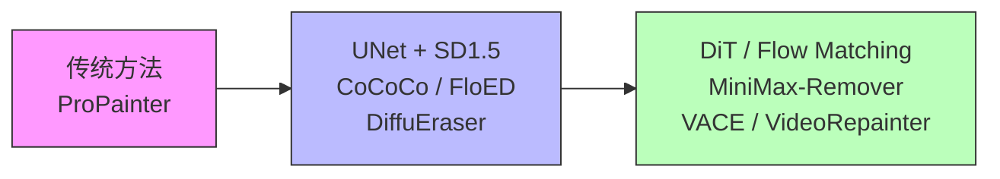
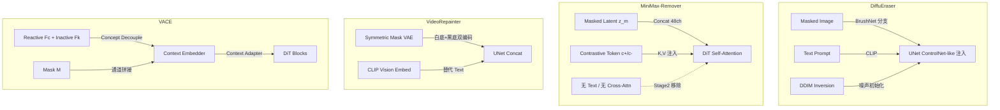
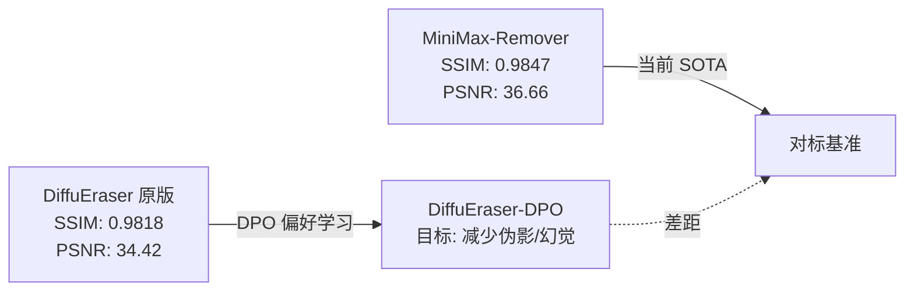

# Video Inpainting 文献综述 & DiffuEraser-DPO 技术对标分析

> 基于 8 篇核心论文的深度阅读，面向 `H20_Video_inpainting_DPO` 仓库的训练策略决策。

---

## 1. 论文全景图

| # | 论文 | 基座模型 | 架构类型 | 核心创新 | 推理步数 | CFG | 额外先验 |
|---|------|---------|---------|---------|---------|-----|---------|
| 1 | **DiffuEraser** | SD1.5 (UNet) | BrushNet + UNet + MotionModule | DDIM Inversion + ProPainter 先验 | 70 | ✓ | 光流, DDIM Inv |
| 2 | **ProPainter** | - (非扩散) | 双域传播 + 稀疏视频 Transformer | 流引导传播 + Mask-guided 稀疏注意力 | N/A | N/A | 光流 |
| 3 | **CoCoCo** | SD1.5 (UNet) | 增强运动捕获模块 | Damped Global Attention + 实例感知区域选择 | 50 | ✓ | Text |
| 4 | **FloED** | SD1.5 (UNet) | 双分支 (Flow + Content) | 光流嵌入注入 + 两阶段训练 | 25 | ✓ | 光流, Text, 首帧 |
| 5 | **MiniMax-Remover** | Wan2.1-1.3B (DiT) | 简化 DiT (去 Cross-Attn) | MiniMax 对抗噪声优化 + 对比条件 Token | **6** | **✗** | 无 |
| 6 | **VACE** | LTX-Video / Wan-T2V-14B (DiT) | Context Adapter + VCU | Video Condition Unit + Concept Decouple | 25-40 | ✓ | 多模态 |
| 7 | **VideoComposer** | SD (3D UNet) | STC-Encoder + 多条件 | 运动向量时序控制 + 组合式条件融合 | 50 (DDIM) | ✓ | Motion Vector, Depth, Sketch |
| 8 | **VideoRepainter** | SVD (DiT/UNet) | I2V + LoRA + Symmetric Mask | Symmetric Mask 解决下采样歧义 + Keyframe 引导 | 25 (Euler) | ✓ | 关键帧 |

---

## 2. 架构范式演进



### 2.1 UNet 系 (SD1.5 基座)

- **DiffuEraser**: BrushNet 作为 ControlNet-like 条件注入分支，UNetMotionModel 处理时序。`ε-prediction` + DDPM。
- **CoCoCo**: 标准 UNet + 额外 MotionCapture 模块 (damped global attention)。
- **FloED**: 双分支 UNet，一条处理光流嵌入，一条处理内容生成。

### 2.2 DiT / Flow-Matching 系 (新一代)

- **MiniMax-Remover**: 基于 Wan2.1-1.3B DiT，**删除所有 Cross-Attention 层** + 对比条件 Token 注入 Self-Attention。使用 Flow Matching 而非 DDPM。
- **VACE**: 基于 LTX-Video / Wan-T2V-14B DiT，Context Adapter (Res-Tuning) 注入条件。
- **VideoRepainter**: 基于 SVD (I2V)，LoRA 微调 (<2% 参数)。

> [!IMPORTANT]
> **DiffuEraser 仍属 SD1.5/UNet 范式**，而领域前沿已转向 DiT/Flow-Matching。DPO 微调作为一种 **后处理优化**，在不更换基座的前提下是合理的提升策略。

---

## 3. 训练策略对比

### 3.1 两阶段 SFT 训练 (行业共识)

| 方法 | Stage 1 | Stage 2 | 备注 |
|------|---------|---------|------|
| **DiffuEraser** | 空间修复 (UNet2D + BrushNet) | 时序模块 (MotionModule) | Stage2 载入 Stage1 空间权重 |
| **FloED** | 流引导分支预训练 | 双分支联合微调 | 光流嵌入冻结 |
| **MiniMax-Remover** | 全模型 (简化 DiT + 对比 Token + CFG) | MiniMax 对抗优化 (去 CFG) | Stage2 仅用 10K 人工筛选数据 |
| **VACE** | 基础任务 (inpaint/extension) | 扩展任务 + 高质量数据微调 | 渐进式多任务 |
| **VideoComposer** | Text-to-Video 预训练 | 多条件组合训练 | 时序先于空间 |
| **VideoRepainter** | 低分辨率训练 (320×576) | 高分辨率微调 (576×1024) | LoRA, 仅更新 1.8% 参数 |

> [!TIP]
> **DiffuEraser-DPO 的两阶段 SFT → 两阶段 DPO 策略**与行业标准吻合。Stage1 解决空间质量，Stage2 解决时序一致性，这是跨论文的共识结构。

### 3.2 偏好学习 / 对抗优化 对比

| 方法 | 优化方式 | 正样本 | 负样本 | 关键超参 |
|------|---------|--------|--------|---------|
| **DiffuEraser-DPO** | Diffusion-DPO 偏好 loss | GT 帧 (winner) | 退化修复结果 (loser) | `beta_dpo=500` |
| **MiniMax-Remover** | MiniMax 对抗优化 | 人工筛选成功修复 (z_succ) | 对抗噪声下的失败结果 | `α ∈ [0, 1]` (噪声强度) |

> [!WARNING]
> **MiniMax-Remover 和 DiffuEraser-DPO 解决的是同一个问题**——减少幻觉/伪影——但路径不同：
> - MiniMax 通过 **对抗噪声** 令模型对 "bad noise" 鲁棒，间接免除 CFG
> - DiffuEraser-DPO 通过 **偏好学习** 直接拉近 policy 与 GT、远离退化结果
> 
> MiniMax 的优势在于 **推理快** (6 步无 CFG)，但依赖人工标注 10K 样本加噪声搜索。DiffuEraser-DPO 的优势在于 **不需要人工标注**，直接用 GT vs. 退化结果构造偏好对。

---

## 4. 条件注入机制对比



### 关键发现

1. **Mask 处理**: VideoRepainter 提出 **Symmetric Mask Conditioning** (双色编码) 解决 VAE 下采样导致的 mask 歧义。DiffuEraser 直接用 GT masked image 作为 BrushNet 条件。
2. **Text 的冗余性**: MiniMax-Remover 明确论证 text prompt 对 Object Removal 任务是 **冗余** 的，直接移除 Cross-Attention 减少参数。DiffuEraser 仍保留 text encoder。
3. **条件泄漏防护**: DiffuEraser-DPO 的 dataset 使用统一 GT masked image condition 防止信息泄漏——这是正确的设计。

---

## 5. 性能基准对比 (DAVIS)

| 方法 | SSIM ↑ | PSNR ↑ | TC ↑ | 推理时间 | GPU 显存 |
|------|--------|--------|------|---------|---------|
| ProPainter | 0.9748 | 35.33 | 0.9769 | 0.27s | 13.5GB |
| DiffuEraser | 0.9818 | 34.42 | 0.9767 | 0.35s | 10.4GB |
| VACE | 0.9102 | 31.92 | 0.9747 | 1.93s | 23.6GB |
| FloED | 0.9053 | 32.02 | 0.9630 | 1.32s | 47.6GB |
| VideoPainter | 0.9654 | 34.60 | 0.9620 | 8.14s | 44.7GB |
| **MiniMax-Remover (6步)** | **0.9842** | **36.56** | **0.9770** | **0.18s** | **8.2GB** |
| **MiniMax-Remover (50步)** | **0.9847** | **36.66** | **0.9776** | - | - |

> [!IMPORTANT]
> **MiniMax-Remover 在 DAVIS 上全面超越所有方法**，包括 DiffuEraser。尤其是 PSNR (36.66 vs 34.42) 和推理速度 (0.18s vs 0.35s)。这为 DiffuEraser-DPO 提供了一个很高的对标基准。

---

## 6. DiffuEraser-DPO 仓库的风险与建议

### 6.1 已确认的风险

| 风险项 | 严重程度 | 详情 |
|--------|---------|------|
| `beta_dpo` 默认值不一致 | ✅ 已修复 | train script、Python launcher、sbatch 默认已统一到 500.0 |
| SFT 训练步数不一致 | ✅ 已修复 | SFT launcher 与 sbatch 默认已统一到 26000 |
| DPO Stage1 仅优化空间 | 🟡 中 | 时序一致性完全依赖 Stage2 |
| 数据集版本混淆 | 🟡 中 | 新旧 `dpo_dataset.py` 可能混用 |

### 6.2 与文献对标后的新建议

| 建议 | 来源 | 优先级 |
|------|------|--------|
| **统一 `beta_dpo=500.0`** | DPO 标准实践 | 🔴 P0 |
| **探索 Symmetric Mask Conditioning** | VideoRepainter | 🟢 P2 (可选提升) |
| **Stage2 DPO 增加对抗噪声采样** | MiniMax-Remover 启发 | 🟡 P1 (实验性) |
| **评估去除 Text Prompt 的影响** | MiniMax-Remover 论证 | 🟢 P2 |
| **增加 Rectified Flow 蒸馏以加速推理** | MiniMax-Remover Stage2 | 🟢 P2 |

### 6.3 DPO Loss 实现验证

DiffuEraser-DPO 的 loss：
```python
loss = -logsigmoid(-0.5 * beta_dpo * (model_diff - ref_diff))
```

与标准 Diffusion-DPO 公式对比：

$$\mathcal{L}_{DPO} = -\log\sigma\left(-\beta \left[ \underbrace{\|\epsilon_\theta(x_t^w) - \epsilon^w\|^2 - \|\epsilon_\theta(x_t^l) - \epsilon^l\|^2}_{\text{policy diff}} - \underbrace{\|\epsilon_{ref}(x_t^w) - \epsilon^w\|^2 - \|\epsilon_{ref}(x_t^l) - \epsilon^l\|^2}_{\text{ref diff}} \right]\right)$$

> [!NOTE]
> 实现中 `model_diff = winner_loss - loser_loss`（policy 模型），`ref_diff = ref_winner_loss - ref_loser_loss`（冻结参考模型）。公式结构正确。
> 
> 注意 `-0.5 * beta_dpo` 中的 **0.5 系数**仍然意味着有效缩放是标称 beta 的一半；当前 launcher 与训练脚本已统一使用 `beta_dpo=500`。

---

## 7. 时序建模策略对比

| 方法 | 时序建模方式 | 长视频策略 |
|------|-------------|-----------|
| **DiffuEraser** | MotionModule (AnimateDiff 风格) | 滑窗推理 + DDIM Inversion 噪声对齐 |
| **ProPainter** | 流引导传播 + 稀疏时序 Transformer | 子片段拼接 |
| **CoCoCo** | Damped Global Attention | 直接推理 |
| **MiniMax-Remover** | DiT 内建 Self-Attention (全局时序) | 滑窗 (前 N 帧 mask=0) |
| **VACE** | DiT 内建 + Context Adapter | 渐进式扩展 |
| **VideoRepainter** | SVD 时序卷积/Attention + LoRA | 稀疏采样 + MultiDiffusion |

> [!TIP]
> DiffuEraser 的 MotionModule 分离设计使得 DPO Stage2 可以 **单独优化时序模块**（冻结空间权重），这是其架构的优势。MiniMax-Remover 因为是全局 DiT 结构，无法做这种分离优化。

---

## 8. 数据构造策略对比

| 方法 | 训练数据 | Mask 生成 | 数据规模 |
|------|---------|----------|---------|
| **DiffuEraser-SFT** | WebVid (图像+视频) | 随机 mask + SAM2 | ~2.5M |
| **DiffuEraser-DPO** | GT + 退化修复结果 | GT masked image (统一条件) | 数据集规模未明 |
| **MiniMax-Remover** | Stage1: WebVid 2.5M; Stage2: 10K 人工筛选 | Grounded-SAM2 + CogVLM2 | 2.5M + 10K |
| **VACE** | 多任务混合 | SAM2 + 多种增强 | 大规模多任务 |
| **VideoRepainter** | 300K 无水印视频 | 内容无关 mask 增强 (Grid/Square/Scribble) | 300K |

> [!NOTE]
> VideoRepainter 提出的 **内容无关 mask 增强策略** (Grid/Square/Scribble + 时序 Bezier 轨迹) 值得借鉴。DiffuEraser-DPO 数据集的 mask 构造方式需确认是否足够多样。

---

## 9. 关键结论

### 9.1 DiffuEraser-DPO 的定位



- DiffuEraser-DPO 本质是 **在不更换基座模型的前提下，通过偏好学习提升修复质量**
- 如果做得好，可以缩小与 MiniMax-Remover 的差距，但受限于 SD1.5/UNet 架构
- 长期来看，迁移到 DiT 基座 + Flow Matching 是不可避免的方向

### 9.2 立即可执行的优化

1. **统一 `beta_dpo`**：全部设为 500.0 (考虑到 0.5 系数，实际有效 beta = 250)
2. **验证 DPO Stage2 的 timestep 分离逻辑**：确认 `timesteps_all_2d` vs `timesteps_all_motion` 的正确性
3. **增加 loser 样本多样性**：当前仅用退化修复结果，可考虑加入不同噪声水平/不同推理步数的结果

### 9.3 未来方向

1. 迁移到 DiT 基座 (Wan2.1 / LTX-Video)
2. 借鉴 MiniMax 的 MiniMax 对抗训练作为 DPO 的补充
3. 引入 Symmetric Mask Conditioning 提升 mask 边界精度
4. 探索去除 CFG 的可能性 (结合 MiniMax 的论证)

---

*文档生成时间: 2026-04-18 | 基于 8 篇论文全文精读*
